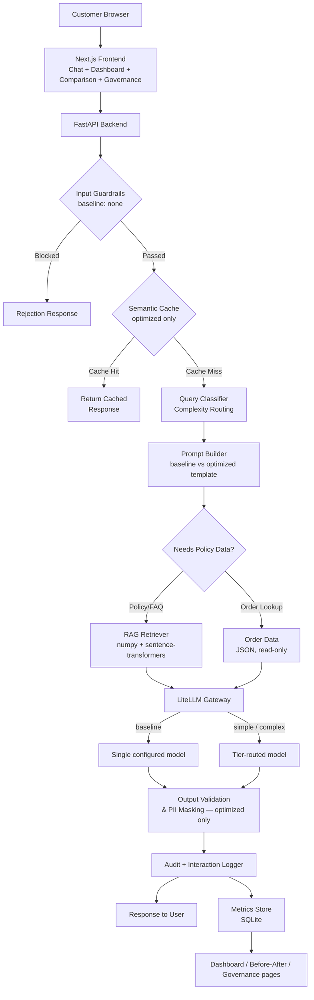

# OptiBot: AI-Optimized eCommerce Order Tracking Assistant

**Product Requirements Document**

| Field | Value |
|-------|-------|
| Version | 1.1 |
| Date | 2026-08-03 |
| Status | Living document — reconciled against the implemented codebase |
| Tech Stack | Python + FastAPI, Next.js, LiteLLM |
| Timeline | 3-5 Days |

## Executive Summary

OptiBot is an eCommerce order tracking chatbot that demonstrates measurable before-and-after improvements in GenAI workflow effectiveness. The solution implements six optimization layers — intelligent model routing, prompt optimization, RAG-grounded retrieval, semantic caching, governance guardrails, and a real-time monitoring dashboard — to prove how GenAI can be made more efficient, governed, measurable, and user-centric. Built with Python/FastAPI, Next.js, and LiteLLM, OptiBot provides a **baseline vs optimized toggle** that lets evaluators see the impact of each optimization in real time across cost, accuracy, latency, and governance metrics. A one-click **automated simulation ("Play" button)** runs a curated batch of test questions through both pipelines back-to-back, so the before/after dashboard can be populated and demonstrated in seconds rather than by typing each comparison by hand.

---

## 1. Problem Statement

### The Business Problem

eCommerce customers frequently ask "where is my order?" questions — a high-volume, repetitive interaction pattern that is a natural fit for AI automation. However, current AI chatbot implementations in this space suffer from critical shortcomings:

- **Hallucinated order statuses**: The LLM fabricates delivery dates, tracking numbers, and order states when it lacks grounded data.
- **Inconsistent policy answers**: Without retrieval-grounded knowledge, the chatbot invents return windows, refund procedures, and shipping timelines.
- **High token and compute costs**: Verbose, unoptimized prompts and a single expensive model for all query types drive unnecessary spend.
- **No governance controls**: PII flows through logs unmasked, prompt injection attacks go undetected, and there is no audit trail for compliance.
- **Poor user trust**: Hallucinated answers and inconsistent responses erode customer confidence in the AI assistant.

### The Technical Problem

Many GenAI deployments are shipped without adequate focus on:

- **Prompt efficiency** — bloated system prompts waste tokens on every request
- **Model routing** — a single model handles all queries regardless of complexity
- **Retrieval grounding** — no RAG pipeline to anchor responses in factual data
- **Caching** — semantically identical queries trigger redundant LLM calls
- **Security and governance** — no input/output validation, no PII protection, no audit logging

As adoption scales, these gaps compound into unnecessary cost, unreliable responses, compliance risk, and limited business impact.

### What This Project Proves

A single eCommerce chatbot scenario demonstrating **six optimization layers** that produce measurable improvements across all four hackathon evaluation lenses: Performance & Efficiency, Trust & Governance, Value & Operations, and User Experience.

---

## 2. Business Scenario — eCommerce Order Tracking

### Domain Context

Online retail / eCommerce — one of the highest-volume customer service domains, where AI chatbots handle millions of order-related queries daily.

### User Persona

**Primary User: Online Shopper**

- Has placed one or more orders on an eCommerce platform
- Wants to check order status, track shipments, understand return/refund policies, or escalate issues
- Expects fast, accurate, and trustworthy responses
- Will lose confidence in the chatbot if it provides fabricated information

### Query Complexity Tiers

| Tier | Type | Examples | Routing Target |
|------|------|----------|---------------|
| **Tier 1 — Simple** | Direct order lookup | "Where is my order #12345?", "What's the status of order #67890?" | Fast/cheap model (gateway `simple` slot) |
| **Tier 2 — Medium** | Policy/FAQ questions | "What is your return policy?", "How long does shipping take to California?" | Capable model (gateway `complex` slot) |
| **Tier 3 — Complex** | Multi-order, disputes, edge cases | "I received a damaged item from order #12345 and want a refund, but order #67890 hasn't shipped yet — can you help with both?" | Capable model, enriched context (gateway `complex` slot) |

Model identity is not hardcoded — OptiBot talks to one LiteLLM gateway and picks per-tier
aliases (`baseline`, `simple`, `complex`) that are configured via `backend/.env` or live from
the gear-icon settings panel. A lab default points all three at Gemini aliases, but any
gateway-exposed model (Claude, GPT-4o, etc.) works without a code change.

### Why eCommerce Order Tracking

- **High volume**: Natural fit for demonstrating cost optimization at scale
- **Clear complexity spectrum**: Enables model routing demonstration
- **Natural RAG use case**: Policies, FAQs, and shipping docs need retrieval grounding
- **Obvious caching opportunities**: Many customers ask the same questions
- **Straightforward synthetic data generation**: Orders, products, and shipments are easy to model
- **Strong governance angle**: Customer PII (addresses, emails, phone numbers) requires protection

---

## 3. Solution Architecture

### High-Level Architecture



Orders, customers, products, and shipments are static synthetic JSON files read directly
by `order_service.py` — there is no SQLite order database. SQLite is used only for the
metrics/audit tables the dashboard reads from.

### Component Breakdown

| Component | Technology | Purpose |
|-----------|-----------|---------|
| Frontend | Next.js 15 (React 19) | Chat interface, dashboard, before/after comparison, governance log, gateway settings panel |
| API | FastAPI (Python) | Request handling, routing |
| LLM Gateway client | LiteLLM (`litellm` SDK) → operator-supplied gateway | Model calls, token/cost accounting; per-slot alias routing decided by OptiBot, not LiteLLM's own router |
| Vector store | In-process numpy matrix | Cosine-similarity retrieval over the embedded policy corpus — no external vector DB |
| Embeddings | sentence-transformers (`all-MiniLM-L6-v2`), lexical fallback if not installed | Shared by RAG retrieval and the semantic cache |
| Semantic Cache | In-memory dict, optimized pipeline only | Cache similar queries by cosine similarity, partitioned by resolved facts |
| Order/Customer/Product/Shipment data | Static JSON files | Synthetic dataset, generated once by `scripts/generate_data.py` |
| Guardrails | Custom Python service (`guardrails.py`), not framework middleware | Injection detection, rate limiting, output verification against order data |
| Metrics Store | SQLite | Interaction metrics, audit log, before/after comparison data |
| Monitoring | Next.js + Recharts | Dashboard, before/after charts, governance/audit browser |

---

## 4. AI Workflow Optimization Layers

### Layer 1: Intelligent Model Routing (via LiteLLM)

**Baseline ("Before")**
Every query is sent to the same single, deliberately expensive model regardless of complexity — configured in the `baseline` gateway slot. A simple "where is order #12345?" costs the same as a complex multi-order dispute resolution.

**Optimized ("After")**
A rule-based query classifier (`app/services/classifier.py`, keyword and pattern heuristics — no LLM call, since routing with a model would spend the cost it is meant to save) sorts each query into a tier and routes it to the matching gateway slot:

| Query Tier | Gateway slot | Notes |
|-----------|-------|-------|
| Simple (order status) | `simple` | Cheapest configured model |
| Medium (policy Q&A) | `complex` | Same slot as complex — the split that matters here is baseline-vs-tiered, not a three-way model split |
| Complex (multi-issue) | `complex` | Enriched context (all referenced orders resolved) |

Actual cost/latency depend entirely on which models the operator points the gateway
slots at, so this PRD does not hardcode per-tier dollar figures — the live numbers are
whatever the Dashboard and Before/After pages measure for the models in use. Prices are
looked up from a local table in `llm_client.py` (Anthropic, Gemini, and OpenAI aliases,
longest-prefix matching for lab/version-suffixed names) rather than trusting the
gateway's own cost figure, which several gateways report as `0.0` for unpriced aliases.

**Implementation:**
- `app/services/classifier.py` — complexity tiering via keyword/pattern heuristics
- `app/services/llm_client.py` — `select_model(mode, tier)` resolves (mode, tier) to a
  gateway alias, plus token/cost accounting
- `app/llm_settings.py` + the gear-icon settings panel — per-slot alias is operator
  configurable at runtime (`backend/llm_runtime.json`), not baked into the code

**Target Metrics:**
- Cost per query: **40-60% reduction** (weighted average across query mix)
- Latency for simple queries: **50-70% reduction**
- Quality score: **No degradation** — same or better accuracy

---

### Layer 2: Prompt Optimization

**Baseline ("Before")**
Verbose, unstructured system prompts (~800-1000 tokens) that repeat instructions, include unnecessary context, and use natural language where structured formats would be more efficient.

```
BASELINE PROMPT EXAMPLE (~850 tokens):
You are a helpful customer service assistant for our eCommerce store.
You help customers with their orders. When a customer asks about their
order, you should look at the order information and tell them about it.
You should be polite and helpful. You should also help with return
policies and shipping questions. Make sure to be accurate and don't
make things up. If you don't know something, say so. Always be
professional and courteous in your responses. Our store sells various
products and we ship to many locations...
[continues for ~800 more tokens of generic instructions]
```

**Optimized ("After")**
Compressed, structured prompts (~350-450 tokens) using role/context/task format with few-shot examples and structured output instructions.

```
OPTIMIZED PROMPT EXAMPLE (~400 tokens):
Role: eCommerce order support agent for ShopFast.
Context: {{order_data_json}}
Task: Answer the customer query using ONLY the provided order data
and retrieved policy context. Format: JSON {response, confidence, sources}.
Rules:
- Never fabricate order statuses, dates, or tracking numbers
- Cite policy source when answering policy questions
- Flag uncertainty with confidence < 0.7
[2 few-shot examples, ~150 tokens]
```

**Implementation:**
- Prompt template registry with baseline and optimized variants per query type
- Dynamic context injection — only include order data relevant to the specific query
- Token counting middleware logs template used and token count

**Target Metrics:**
- Token consumption per request: **30-50% reduction**
- Response quality: **Maintained or improved** (measured via golden dataset)

---

### Layer 3: RAG for Policies and FAQs

**Baseline ("Before")**
No RAG pipeline. The LLM answers policy questions from training data, leading to:
- Hallucinated return windows (e.g., "30-day return policy" when actual is 14 days)
- Fabricated shipping timeframes
- Invented refund procedures and warranty terms

**Optimized ("After")**
Policy documents chunked, embedded, and held in an in-process numpy matrix (built once at
startup — see `app/services/rag_service.py`). At query time:

1. Query is embedded with the same backend as the corpus (`all-MiniLM-L6-v2` via
   sentence-transformers, or a domain-aware lexical fallback if that package is not
   installed, so the app still runs without `torch`)
2. A wider candidate pool (top `k*3`, min 8) is pulled by cosine similarity
3. Candidates are re-ranked with a cheap lexical pass — boosting exact query-term overlap
   and penalizing a second chunk from a source already picked, since pure cosine over a
   small corpus tends to return three chunks from the same document
4. The top-k chunks above a relevance floor are injected into the prompt as context
5. Response includes source citation (e.g., "According to our Return Policy...")

**Policy Documents for RAG** (actual corpus, `backend/app/data/policies/`):

| Document | Chunk Count |
|----------|-------------|
| Return Policy | 6 |
| Shipping Policy | 7 |
| FAQ | 10 |
| Warranty Policy | 5 |
| Escalation Guide | 5 |
| **Total** | **33** |

**Implementation:**
- Chunking splits on `##` markdown headings first (a chunk is a coherent rule, not an
  arbitrary window), then subdivides any oversized section using a 300-token budget with
  50-token overlap
- Top-k retrieval: k=3 (`OPTIBOT_RAG_TOP_K`), relevance floor 0.15 (`OPTIBOT_RAG_MIN_SCORE`)
- No external vector database — at ~33 chunks a numpy matrix is exact and adds no extra
  failure mode or dependency

**Target Metrics:**
- Hallucination rate on policy questions: **~35% → <5%**
- Policy answer accuracy: **~60% → >95%**
- Source citation rate: **0% → >90%** for policy queries
- Retrieval precision@3: **>85%**

---

### Layer 4: Semantic Caching

**Baseline ("Before")**
Every query triggers a full LLM call, even when semantically identical questions were asked recently. "Where is order 12345?" and "What's the status of order 12345?" both make separate LLM calls.

**Optimized ("After")**
Incoming queries are embedded and compared against a cache of recent query-response pairs
(`app/services/cache_service.py`). Baseline never consults the cache — that gap is the
point being measured.

1. Query is normalized (`ORD-10042` → `<order_id>`) and embedded with the same backend as RAG
2. Cosine similarity computed against cached query embeddings
3. If similarity ≥ threshold, return the cached response — **but only if the resolved
   facts also match**: the entry is additionally keyed on a hash of the resolved order
   IDs and policy sources, so two customers asking the same question about different
   orders can never collide
4. Cache entries have a TTL (5 minutes for order queries, 30 minutes for policy queries)
5. Only answers that passed output guardrails and cleared the confidence floor get stored,
   so a bad answer is never cached and repeatedly served

**Implementation:**
- In-memory dict, per backend process (not shared across instances — a fine tradeoff for
  a single-instance demo, not production-grade)
- Similarity threshold: **0.80**, calibrated (not guessed) by `scripts/calibrate_cache.py`
  against a labelled pair set that includes deliberate near-misses ("how long does
  standard shipping take" vs "how much does express shipping cost"); tuned for precision
  over recall since a false hit serves one customer another customer's answer
- TTL: 300s for order queries, 1800s for policy queries (`OPTIBOT_CACHE_TTL_ORDER` /
  `OPTIBOT_CACHE_TTL_POLICY`)
- Re-run the calibration script if the embedding model changes — the right threshold is
  model-specific

**Target Metrics:**
- Cache hit rate: **25-40%** for common query patterns
- Latency on cache hits: **80-90% reduction** (sub-100ms vs 1-3s)
- Cost savings from avoided LLM calls: proportional to cache hit rate

---

### Layer 5: Guardrails and Governance

**Baseline ("Before")**
No input validation, no output verification, no PII protection, no audit trail. The chatbot blindly processes any input and returns any output.

**Optimized ("After")**

Guardrails are a plain Python service module (`app/services/guardrails.py`), applied only
on the optimized path — baseline deliberately has zero guardrails, which is what the
Governance page's baseline-vs-optimized columns are contrasting.

#### Input Guardrails
| Guard | Description | Action |
|-------|------------|--------|
| Prompt injection detection | Six pattern families: instruction override, system-prompt probing, role-switching/jailbreak, delimiter injection, data-exfiltration requests, credential requests | Block + log, generic refusal message |
| Input length limit | Max 500 characters per message | Truncate, flag `input_truncated` |
| Rate limiting | Max **20** requests/minute per session (fixed window) | Reject with a wait message |
| Abusive language | Profanity pattern match | Logged, **not blocked** — a frustrated customer still gets an answer |

#### Output Guardrails
| Guard | Description | Action |
|-------|------------|--------|
| Order number validation | Every order ID the model states is checked against what this request actually resolved (or, failing that, against the database) | Replace with `[unverified order number]` |
| Tracking number validation | Same check for tracking-number-shaped strings | Replace with `[unverified tracking number]` |
| Confidence scoring | Model-reported confidence below 0.7 (`low_confidence_threshold`) triggers a disclaimer prefix | Prepend "I'm not fully certain, but..." |
| Forbidden content filter | Competitor names / internal-system phrasing | Redact to `[redacted]` |
| Response length limit | Optimized calls are capped server-side at 700 output tokens (baseline: 1024) | N/A — bounded at generation time, not truncated after |

#### PII Protection
- Detect PII patterns: email addresses, phone numbers, physical addresses, full names
  (`app/services/pii_detector.py`)
- Mask PII **before anything is persisted** in the optimized path — masking happens on the
  write path, not the response path, since a customer is entitled to see their own email
  in the reply but it must never land unmasked in a log an operator can browse
- **Baseline deliberately logs PII unmasked** — this is not an oversight, it is the exact
  gap the "unmasked PII stored" counter on the Governance page measures

#### Audit Logging
Every interaction logged with:
```json
{
  "timestamp": "2026-07-29T14:30:00Z",
  "session_id": "abc-123",
  "query_classification": "simple",
  "model_used": "claude-haiku-4-5-20251001",
  "token_count": {"input": 280, "output": 95},
  "latency_ms": 480,
  "cache_hit": false,
  "guardrail_triggers": [],
  "cost_usd": 0.0003,
  "pii_detected": true,
  "pii_masked": true,
  "response_confidence": 0.92
}
```

**Target Metrics:**
- Prompt injection detection rate: **>95%**
- PII in logs: **0 unmasked instances**
- Audit log coverage: **100%** of interactions
- Guardrail false-positive rate: **<2%**

---

### Layer 6: Monitoring Dashboard

**Baseline ("Before")**
No visibility into chatbot performance. No way to compare cost, quality, or latency. No governance transparency.

**Optimized ("After")**
Three separate Next.js pages, all reading from the same SQLite metrics/audit tables via
`GET /api/metrics/*`:

#### `/dashboard` — Monitoring
- Recharts comparison charts (baseline vs optimized) built from **run totals**, not a
  rolling time window — there is no background aggregation job, every load re-queries
  current state
- Model routing mix for the optimized pipeline
- A "reset" action (`POST /api/metrics/reset`) to clear accumulated data for a fresh run

#### `/comparison` — Before/After
- Side-by-side metrics mapped to the evaluation lenses in this PRD (cost, tokens,
  latency, hallucination/accuracy proxies)

#### `/governance` — Audit
- Event-type breakdown (chat, cache hit, blocked input, error, etc.)
- Audit log browser, most recent 100 entries
- Surfaces the baseline-vs-optimized PII-masking gap directly (§Layer 5)

**Implementation:**
- FastAPI endpoints (`app/routers/metrics.py`) serving aggregated queries from SQLite —
  `/api/metrics/summary`, `/api/metrics/interactions`, `/api/metrics/governance`,
  `/api/metrics/audit`, `/api/metrics/reset`
- Plain polling where the UI needs freshness (the Play button's progress feed polls
  `/api/simulate/status` every 800ms); the dashboard pages themselves just fetch on load —
  no WebSocket, no CSV export
- A separate gear-icon **settings panel** (not one of the six layers, but present on every
  page) lists the gateway's available models, lets the operator set the LiteLLM base URL
  and key at runtime, and assigns a model alias per routing slot — see
  `frontend/src/components/SettingsPanel.tsx` and `app/routers/llm_config.py`

---

### Layer 6.1: Automated Simulation — the "Play" Button

**The problem this solves**

Populating the before/after view by hand means typing the same handful of
questions twice — once in Baseline, once in Optimized — enough times that the
averages mean something. That is slow to do live, and easy to skip during a
rushed demo, leaving the dashboard looking empty or thin exactly when it needs
to look most convincing.

**What it does**

A **▶ Play demo** control on the chat page runs a curated batch of the golden
test questions (see §5, Golden Test Queries) through the pipeline
automatically — baseline first, then optimized, one question at a time —
using the exact same `chat_service.handle()` call a manually typed message
uses. There is no separate "demo mode" data path: a simulated turn is a real
turn, so every number it produces is exactly as trustworthy as one from a live
conversation, and it lands in the same SQLite tables the Dashboard, Before/After
Comparison, and Governance pages already read from.

| Property | Behavior |
|---|---|
| Trigger | "▶ Play demo" button, chat page, next to the Baseline/Optimized toggle |
| Question set | 8 hand-picked questions (of the 23-question golden set) run through both modes — 16 chats total |
| Selection rationale | Chosen to hit every optimization layer in one pass: a direct order lookup, the same lookup rephrased (cache hit), two policy questions (RAG), a multi-issue complaint (complex tier), a nonexistent order (hallucination resistance), a prompt injection (guardrails), and a query containing PII (masking) |
| Reset behavior | Clears existing **dashboard** data and the semantic cache before starting, so the before/after numbers reflect only this run — this does not touch the chat transcript (see below) |
| Live feedback | Each question and answer streams into the chat window as it completes, tagged "auto", with the same model / tier / cost / latency pills a manual message gets, plus a pass/fail badge against the golden answer |
| Progress | A progress bar and "{completed}/{total}" counter; a Stop button cancels between questions (an in-flight call finishes; the next one never starts) |
| Manual chat | Disabled while a run is in progress, re-enabled the moment it finishes or is stopped — Play augments manual chat, it does not replace it |
| Baseline/Optimized toggle | Also filters what the chat window shows — with 16 turns from one run (8 baseline + 8 optimized) sharing the window, the toggle scopes the view to one side so they don't read as duplicates of each other |
| Transcript persistence | Survives navigating to Dashboard/Comparison/Governance and back (cached in a module-level variable, mirrored to `sessionStorage` for a hard refresh) — the page component unmounts on route change, so without this the window would come back empty every time |
| Clearing | Manual only — a **"Clear chat"** button next to Play/Stop. A new Play run appends to the existing transcript rather than wiping it; only Clear resets it (disabled mid-run, to avoid the next poll tick re-adding turns the run has already produced) |

**Why baseline-then-optimized, not interleaved**

Matches both the CLI harness (`scripts/run_evaluation.py`) and this PRD's own
demo script (§9): all baseline questions run first against a clean cache, then
the cache is cleared and all optimized questions run — so a cache hit in the
optimized block can only be explained by *this run's* repeated question, never
by a leftover from baseline.

**Implementation:**
- `backend/app/services/evaluation.py` — the golden-query loader, order-placeholder
  binding, and grading logic, shared between the CLI script and the Play button
  so "correct" means the same thing in both places
- `backend/app/services/simulation_service.py` — a background-thread runner that
  starts, polls, and cooperatively cancels a run; only one run at a time
- `backend/app/routers/simulate.py` — `POST /api/simulate/start`,
  `GET /api/simulate/status` (polled by the UI every 800ms), `POST /api/simulate/cancel`
- Frontend (`frontend/src/app/page.tsx`): the existing chat page, extended with the
  Play/Stop/Clear controls, a progress bar, a poll loop that turns each completed step
  into an ordinary chat turn (reusing the existing metric pills, "Last request" card, and
  "Pipeline trace" panel without modification), a mode filter over the rendered turns, and
  a module-level cache backing the transcript so it outlives a route change

**Also available headless:** `python scripts/run_evaluation.py` runs the same
loader and grader against the full 23-question set (not just the curated 8) and
prints the same before/after table this PRD's metrics are drawn from — the Play
button is the same evaluation, just watchable.

---

## 5. Synthetic Data Requirements

All volumes below are actual counts in `backend/app/data/`, generated once (deterministically —
fixed seed) by `scripts/generate_data.py` so repeated before/after runs compare against
byte-identical data.

| Data Type | Description | Volume | Format |
|-----------|------------|--------|--------|
| Customers | Mock customer profiles (name, email, masked address, phone) | 50 | JSON |
| Orders | Orders with status, items, dates, amounts, customer_id | 200 | JSON |
| Products | Product catalog (name, category, price, description) | 30 | JSON |
| Shipments | Tracking events per order (carrier, status, timestamps, location) | 164 (not every order has shipped) | JSON |
| Policy Documents | Return, shipping, FAQ, warranty, escalation guide | 5 docs, 33 chunks total (see §Layer 3) | Markdown |
| Golden Test Queries | Queries with expected answers, classification, and difficulty | 23 | JSON |

Baseline and optimized prompts are not data files — they are template functions in
`backend/app/services/prompts.py` (`build_baseline_messages` / `build_optimized_messages`),
built dynamically per request from whatever order/policy context that request resolved.

### Data Generation Approach

Python scripts generate synthetic data with realistic patterns:
- **Order statuses**: Processing (15%), Shipped (20%), In Transit (25%), Delivered (30%), Returned (5%), Cancelled (5%)
- **Shipment tracking**: Realistic event sequences (Label Created → Picked Up → In Transit → Out for Delivery → Delivered)
- **Products**: Varied categories (Electronics, Clothing, Home, Books) with realistic pricing
- **Edge cases**: Orders with multiple items, split shipments, cancelled-then-reordered scenarios

### Data Quality Expectations
- Anonymized — no real personal information
- Free from sensitive data
- Sufficient to support measurable before/after comparison
- Includes edge cases for guardrail and governance testing

---

## 6. Before/After Metrics and Success Criteria

### Performance & Efficiency

| Metric | Baseline | Optimized Target | Measurement |
|--------|----------|-----------------|-------------|
| Avg tokens per request | ~1,200 | ~600 (50% reduction) | LiteLLM token counting |
| Avg latency (simple query) | ~2.5s | ~0.5s (80% reduction) | Request timing middleware |
| Avg latency (complex query) | ~4.0s | ~2.5s (37% reduction) | Request timing middleware |
| Avg latency (cache hit) | ~2.5s | ~0.1s (96% reduction) | Cache middleware timing |
| Cost per interaction (avg) | ~$0.003 | ~$0.001 (67% reduction) | LiteLLM cost tracking |

### Trust & Governance

| Metric | Baseline | Optimized Target | Measurement |
|--------|----------|-----------------|-------------|
| Policy answer accuracy | ~60% | >95% | Golden dataset evaluation |
| Hallucination rate | ~35% | <5% | Manual review + automated checks |
| PII exposure in logs | Unprotected | 0 instances | Automated log scan |
| Prompt injection blocked | 0% | >95% | Injection test suite |
| Audit log coverage | 0% | 100% | Log completeness check |
| Source citation rate | 0% | >90% (policy queries) | Response analysis |

### Value & Operations

| Metric | Baseline | Optimized Target | Measurement |
|--------|----------|-----------------|-------------|
| Monthly cost (10K queries) | ~$30 | ~$10 (67% savings) | Cost extrapolation |
| Cache hit rate | 0% | 25-40% | Cache middleware metrics |
| Cheaper model usage | 0% | ~60% of queries | Routing classifier logs |
| Operational visibility | None | Full dashboard | Dashboard availability |

### User Experience

| Metric | Baseline | Optimized Target | Measurement |
|--------|----------|-----------------|-------------|
| Response relevance score | 3.5/5 | 4.5/5 | Golden dataset + rubric |
| Source citation in responses | Never | >90% for policy queries | Response analysis |
| Error handling | None | Graceful fallback for all failures | Test scenarios |
| Response consistency | Variable | Consistent format and quality | Rubric evaluation |

---

## 7. Tech Stack Architecture

### Backend (Python + FastAPI)

```
backend/
├── app/
│   ├── main.py                  # FastAPI app entry, lifespan (builds RAG index, logs model slots)
│   ├── __init__.py               # Loads .env and evicts SSL_VERIFY before litellm imports
│   ├── config.py                 # Env-read-once settings: cache/RAG thresholds, rate limit, gateway timeouts
│   ├── llm_settings.py           # Mutable runtime layer over config.py — the gear-icon panel writes here
│   ├── routers/
│   │   ├── chat.py               # POST /api/chat
│   │   ├── health.py             # GET /api/health
│   │   ├── llm_config.py         # GET/POST /api/llm-config, GET /api/llm-config/models, POST /test — settings panel
│   │   ├── metrics.py            # GET /api/metrics/{summary,interactions,governance,audit}, POST /reset
│   │   └── simulate.py           # POST /api/simulate/start, GET /status, POST /cancel — Play button
│   ├── services/
│   │   ├── chat_service.py       # Orchestrates baseline vs optimized pipelines side by side
│   │   ├── classifier.py         # Rule-based query complexity tiering (no LLM call)
│   │   ├── prompts.py            # Baseline vs optimized message/template builders
│   │   ├── rag_service.py        # Heading-based chunking, numpy cosine retrieval, lexical re-rank
│   │   ├── embeddings.py         # sentence-transformers backend with lexical fallback
│   │   ├── cache_service.py      # Semantic cache — optimized path only
│   │   ├── guardrails.py         # Input/output validation, rate limiting
│   │   ├── pii_detector.py       # PII detection and masking
│   │   ├── order_service.py      # Reads the static order/customer/product/shipment JSON
│   │   ├── metrics_service.py    # SQLite metrics + audit log read/write
│   │   ├── llm_client.py         # Model routing decision, local price table, cost accounting
│   │   ├── gateway.py             # LiteLLM transport + TLS bootstrap for the configured gateway
│   │   ├── evaluation.py         # Golden-query loader + grading, shared by the CLI and the Play button
│   │   └── simulation_service.py # Play button's background-thread runner (start/status/cancel)
│   ├── models/
│   │   └── schemas.py            # All Pydantic request/response models
│   └── data/
│       ├── customers.json / orders.json / products.json / shipments.json
│       ├── golden_queries.json   # Also the Play button's question bank
│       └── policies/             # 5 policy markdown documents for RAG
├── requirements.txt
└── tests/
    ├── test_evaluation.py        # Golden dataset loading + grading
    ├── test_gateway.py           # LiteLLM transport / TLS bootstrap
    ├── test_llm_settings.py      # Runtime model-slot persistence
    ├── test_pricing.py           # Local price table resolution
    └── test_simulation_service.py  # Play button runner: progress, cancel, reset behavior
```

### Frontend (Next.js)

```
frontend/
├── src/
│   ├── app/
│   │   ├── layout.tsx            # Root layout — renders Nav + page; page state does not survive route changes
│   │   ├── page.tsx              # Chat + Play/Stop/Clear simulation controls (main page)
│   │   ├── dashboard/page.tsx    # Monitoring dashboard
│   │   ├── comparison/page.tsx   # Before/after comparison view
│   │   └── governance/page.tsx   # Audit log browser
│   ├── components/
│   │   ├── Nav.tsx               # Top nav, health pill, opens SettingsPanel
│   │   ├── SettingsPanel.tsx     # Gear-icon LiteLLM gateway/model settings panel
│   │   └── icons.tsx
│   └── lib/
│       ├── api.ts                # FastAPI client, incl. startSimulation/getSimulationStatus/cancelSimulation
│       └── types.ts              # TypeScript types, incl. SimulationState/SimulationStep
├── package.json
└── next.config.js
```

Chat, dashboard, comparison, and governance are each a single page component — there is no
separate `ChatWindow`/`ChatInput`/`MetricsCard`/`ComparisonChart`/`AuditLog`/`ModeToggle`
component layer; each page owns its own markup and state directly.

### Scripts

```
scripts/
├── generate_data.py             # Seeded synthetic customers/orders/products/shipments generator
├── calibrate_cache.py           # Scores the semantic cache threshold against a labelled pair set
└── run_evaluation.py            # Full 23-case run via app.services.evaluation — the headless twin of the Play button
```

### Key Dependencies

| Package | Purpose |
|---------|---------|
| `fastapi` + `uvicorn` | Backend API framework |
| `litellm` | Client SDK for calling the configured LiteLLM gateway; token/cost accounting |
| `httpx` | Called directly for `/v1/models` on the gateway and the TLS bootstrap |
| `numpy` | In-process vector store for RAG + semantic cache (no external vector DB) |
| `sentence-transformers` (optional) | `all-MiniLM-L6-v2` embeddings; app falls back to a lexical embedder and still boots without it (no `torch` required) |
| `pydantic` | Request/response validation |
| `python-dotenv` | Loads `backend/.env` |
| `next` (15) + `react` (19) | Frontend framework |
| `recharts` | Dashboard charting library |

No `chromadb`, no Redis, no Tailwind — the RAG/cache vector store is a plain numpy
matrix, and styling is hand-written CSS (`frontend/src/app/globals.css`).

---

## 8. Implementation Timeline

### Day 1: Foundation

| Task | Deliverable |
|------|------------|
| Set up project structure (backend + frontend scaffolding) | Working FastAPI + Next.js skeleton |
| Generate synthetic data (customers, orders, products, shipments) | JSON data files |
| Write policy documents for RAG | 5 markdown documents |
| Set up FastAPI with basic `/api/chat` endpoint | Endpoint accepting queries |
| Integrate LiteLLM with a single model (baseline config) | LLM responses working |
| Build baseline prompt templates (verbose, unoptimized) | 3-5 baseline templates |
| **Day 1 Deliverable** | **Baseline chatbot working end-to-end with single model, no optimizations** |

### Day 2: Core Optimizations

| Task | Deliverable |
|------|------------|
| Implement query complexity classifier | Classifier routing queries to 3 tiers |
| Wire up LiteLLM gateway routing (baseline/simple/complex slots) | Model routing operational |
| Build optimized prompt templates | 3-5 compressed templates |
| Chunk and embed policy documents into an in-process numpy index | Vector store loaded |
| Implement RAG retrieval service with lexical re-ranking | RAG retrieval returning relevant chunks |
| **Day 2 Deliverable** | **Model routing + prompt optimization + RAG all functional** |

### Day 3: Caching, Guardrails, and Governance

| Task | Deliverable |
|------|------------|
| Implement semantic caching layer | Cache hit/miss working |
| Build input guardrails (injection detection, validation) | Input filtering active |
| Build output guardrails (order validation, confidence checks) | Output validation active |
| Implement PII detection and masking in logs | PII masked in all logs |
| Set up audit logging | Audit log table populated |
| Create golden test dataset (50-100 queries) | Test dataset ready |
| **Day 3 Deliverable** | **Full optimization pipeline operational with governance controls** |

### Day 4: Frontend, Dashboard, and Evaluation

| Task | Deliverable |
|------|------------|
| Build Next.js chat interface with mode toggle | Chat UI functional |
| Build monitoring dashboard with charts | Dashboard showing metrics |
| Build before/after comparison view | Side-by-side comparison |
| Run baseline vs optimized evaluation | Metrics collected |
| Generate before/after comparison data | Comparison data ready |
| **Day 4 Deliverable** | **Complete working prototype with dashboard showing before/after metrics** |

### Day 5: Polish, Documentation, and Demo Prep

| Task | Deliverable |
|------|------------|
| Fix bugs and edge cases | Stable prototype |
| Finalize PRD and README | Documentation complete |
| Prepare demo script and talking points | Demo ready |
| Record demo video or take screenshots | Demo assets |
| Final metrics validation and report | Final metrics report |
| **Day 5 Deliverable** | **Submission-ready project** |

---

## 9. Demo Script and Evaluation Mapping

### Demo Flow (5 minutes)

**Fast-forward option:** before or instead of narrating Steps 1–2 by hand,
click **▶ Play demo** on the chat page. It runs the same baseline-then-optimized
story across 8 questions automatically — covering a cache hit, a RAG-grounded
policy answer, a blocked injection, and masked PII along the way — so an
evaluator watches the dashboard fill in live rather than take the presenter's
word for the numbers. The Baseline/Optimized toggle scopes the chat window to
one side at a time (useful once 16 turns are on screen); use **Clear chat** if
you want a blank window for a second run — Play appends to the transcript
rather than replacing it. Steps 3–4 below work identically off whatever data
is on screen, whether it came from Play or from typing each question by hand.

**Step 1: Baseline Mode (1.5 min)**
1. Open chat UI in **Baseline mode**
2. Ask: "What is your return policy?" → LLM hallucinates a wrong return window (the real
   policy is 14 days; baseline typically states 30)
3. Ask: "Where is my order #12345?" → Slower response, higher token count than optimized
4. Show dashboard: higher cost, higher latency, hallucination flagged

**Step 2: Switch to Optimized Mode (2 min)**
1. Toggle to **Optimized mode**
2. Ask the same policy question → RAG retrieves the real 14-day policy, cites the source doc
3. Ask the same order query → Routed to the cheap tier, fast response, low cost
4. Ask again, rephrased → Cache hit, near-instant response, zero tokens
5. Show dashboard: cost dropped, latency dropped

**Step 3: Governance Demo (1 min)**
1. Attempt a prompt injection → Blocked, logged in audit
2. Show audit log → optimized interactions masked; baseline rows are **deliberately
   left unmasked** — that contrast is what the "unmasked PII stored" counter measures
3. Show governance page → injection attempts, PII events, audit trail

**Step 4: Before/After Comparison (0.5 min)**
1. Open comparison view → Side-by-side charts
2. Highlight: 67% cost reduction, 50% token savings, hallucination rate 35% → <5%

### Evaluation Lens Mapping

| Evaluation Lens | Where Demonstrated |
|-----------------|-------------------|
| **Performance & Efficiency** | Model routing (Layer 1), Prompt optimization (Layer 2), Semantic caching (Layer 4), Dashboard metrics |
| **Trust & Governance** | RAG accuracy (Layer 3), Guardrails (Layer 5), PII masking, Audit logging, Governance dashboard |
| **Value & Operations** | Cost reduction metrics, Cache hit rate, ROI projection, Monthly cost comparison on dashboard |
| **User Experience** | Chat UI with mode toggle, source citations, graceful error handling, fallback design, transparent dashboard, one-click Play demo |

---

## 10. Risks and Mitigations

| Risk | Impact | Likelihood | Mitigation |
|------|--------|-----------|------------|
| LLM API rate limits during demo | Demo failure | Medium | Pre-cache key demo queries; configure LiteLLM fallback models |
| RAG retrieval quality too low with small corpus | Poor accuracy metrics | Medium | Write high-quality policy docs with clear structure; tune chunk size (300 tokens) and overlap (50 tokens) |
| Semantic cache false positives | Wrong answers served from cache | Low | Calibrated similarity threshold tuned for precision over recall (0.80, see `calibrate_cache.py`); TTL-based expiration; cache key also hashes resolved order IDs/policy sources so order-specific data can never cross-match |
| 3-5 day timeline too tight | Incomplete submission | Medium | Prioritize Layers 1-3 (routing, prompts, RAG) as minimum viable; Layers 4-6 are enhancement layers |
| Synthetic data not realistic enough | Weak demo credibility | Low | Use realistic order status distributions, tracking event sequences, and edge cases |

### Minimum Viable Submission (if time-constrained)

If only 3 days are available, prioritize:
1. Baseline chatbot (Day 1)
2. Model routing + prompt optimization + RAG (Day 2)
3. Basic dashboard with before/after metrics (Day 3)

Caching, guardrails, and governance are high-impact but can be simplified if needed.

---

## 11. Appendices

### Appendix A: Sample Baseline vs Optimized Prompt

**Baseline System Prompt (~850 tokens):**
```
You are a helpful customer service assistant for our eCommerce store called ShopFast.
You help customers with their orders and any questions they might have about our store.
When a customer asks about their order, you should look at any order information available
and tell them about the status of their order, when it will arrive, and any other relevant
details. You should be polite and helpful at all times. You should also be able to help
with questions about our return policy, shipping options, and general store information.
If you don't know something, please let the customer know that you're not sure rather
than making something up. Always maintain a professional and courteous tone in all your
responses. Our store sells a variety of products including electronics, clothing, home goods,
and books. We ship to locations across the United States and offer various shipping speeds...
[continues with more generic instructions]
```

**Optimized System Prompt (~400 tokens):**
```
Role: ShopFast order support agent.
Context: {{order_data}}
Policy Context: {{rag_retrieved_chunks}}

Task: Answer the customer's query using ONLY provided data.
Output: JSON {"response": "...", "confidence": 0.0-1.0, "sources": [...]}

Rules:
1. Never fabricate order IDs, statuses, dates, or tracking numbers.
2. For policy questions, cite the source document name.
3. If confidence < 0.7, prepend "I'm not fully certain, but..."
4. For issues beyond scope, offer human agent escalation.

Examples:
Q: "Where is order #12345?"
A: {"response": "Order #12345 is currently In Transit via FedEx (tracking: FX789). Estimated delivery: Aug 2.", "confidence": 0.95, "sources": ["order_database"]}

Q: "What's your return policy?"
A: {"response": "According to our Return Policy, you have 14 days from delivery to initiate a return for a full refund. Items must be unused and in original packaging.", "confidence": 0.98, "sources": ["return_policy.md"]}
```

### Appendix B: Synthetic Data Schema Examples

**Order** (actual shape, `backend/app/data/orders.json`):
```json
{
  "order_id": "ORD-10001",
  "customer_id": "CUST-041",
  "status": "Processing",
  "items": [
    {
      "product_id": "PROD-010", "name": "Waterproof Hiking Jacket", "category": "Clothing",
      "quantity": 1, "unit_price": 189.0, "line_total": 189.0
    }
  ],
  "subtotal": 189.0,
  "shipping_cost": 12.99,
  "total": 201.99,
  "order_date": "2026-06-03",
  "shipping_method": "Express",
  "shipping_address": {"street": "7873 Hawthorn Ter", "city": "Anchorage", "state": "AK", "zip": "66097"},
  "estimated_delivery": "2026-06-09",
  "tracking_number": null,
  "carrier": null
}
```
(`tracking_number`/`carrier` are `null` until a shipment exists — the matching entry in
`shipments.json`, when present, is the source of truth for tracking events.)

**Shipment:**
```json
{
  "shipment_id": "SHIP-12345",
  "order_id": "ORD-12345",
  "carrier": "FedEx",
  "tracking_number": "FX7890123456",
  "events": [
    {"status": "Label Created", "timestamp": "2026-07-21T08:00:00Z", "location": "Warehouse, TX"},
    {"status": "Picked Up", "timestamp": "2026-07-21T14:30:00Z", "location": "Dallas, TX"},
    {"status": "In Transit", "timestamp": "2026-07-23T06:00:00Z", "location": "Memphis, TN"},
    {"status": "In Transit", "timestamp": "2026-07-25T11:00:00Z", "location": "Chicago, IL"}
  ]
}
```

### Appendix C: Golden Test Query Example

Actual shape, `backend/app/data/golden_queries.json` (order placeholders like
`{ORDER_IN_TRANSIT}` are resolved to a real order ID from the synthetic dataset by
`app/services/evaluation.py` before the query is run, so the same case works against any
regenerated dataset):

```json
{
  "id": "simple-01",
  "query": "Where is my order {ORDER_IN_TRANSIT}?",
  "expected_tier": "simple",
  "expects_rag": false,
  "must_contain_any": ["In Transit", "in transit"],
  "difficulty": "easy",
  "note": "Direct lookup — should route to the cheap model."
}
```

Grading (`evaluation.grade()`) checks the response contains at least one of
`must_contain_any` (case-insensitive) and, when `expects_rag` is true, that a policy
source was actually cited — not tier or model identity, since those are gateway-configured
and not part of what "correct" means for a given question.

---

*This PRD is a living document and will be updated as implementation progresses.*
