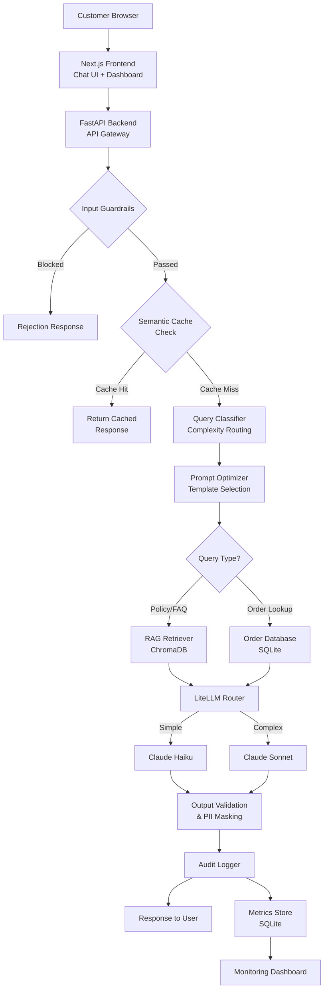

# OptiBot: AI-Optimized eCommerce Order Tracking Assistant

**Product Requirements Document**

| Field | Value |
|-------|-------|
| Version | 1.0 |
| Date | 2026-07-29 |
| Status | Draft |
| Tech Stack | Python + FastAPI, Next.js, LiteLLM |
| Timeline | 3-5 Days |

## Executive Summary

OptiBot is an eCommerce order tracking chatbot that demonstrates measurable before-and-after improvements in GenAI workflow effectiveness. The solution implements six optimization layers — intelligent model routing, prompt optimization, RAG-grounded retrieval, semantic caching, governance guardrails, and a real-time monitoring dashboard — to prove how GenAI can be made more efficient, governed, measurable, and user-centric. Built with Python/FastAPI, Next.js, and LiteLLM, OptiBot provides a **baseline vs optimized toggle** that lets evaluators see the impact of each optimization in real time across cost, accuracy, latency, and governance metrics. A one-click **automated simulation ("Play" button)** runs a curated batch of test questions through both pipelines back-to-back, so the before/after dashboard can be populated and demonstrated in seconds rather than by typing each comparison by hand.

---

## 1. Problem Statement

### The Business Problem

eCommerce customers frequently ask "where is my order?" questions — a high-volume, repetitive interaction pattern that is a natural fit for AI automation. However, current AI chatbot implementations in this space suffer from critical shortcomings:

- **Hallucinated order statuses**: The LLM fabricates delivery dates, tracking numbers, and order states when it lacks grounded data.
- **Inconsistent policy answers**: Without retrieval-grounded knowledge, the chatbot invents return windows, refund procedures, and shipping timelines.
- **High token and compute costs**: Verbose, unoptimized prompts and a single expensive model for all query types drive unnecessary spend.
- **No governance controls**: PII flows through logs unmasked, prompt injection attacks go undetected, and there is no audit trail for compliance.
- **Poor user trust**: Hallucinated answers and inconsistent responses erode customer confidence in the AI assistant.

### The Technical Problem

Many GenAI deployments are shipped without adequate focus on:

- **Prompt efficiency** — bloated system prompts waste tokens on every request
- **Model routing** — a single model handles all queries regardless of complexity
- **Retrieval grounding** — no RAG pipeline to anchor responses in factual data
- **Caching** — semantically identical queries trigger redundant LLM calls
- **Security and governance** — no input/output validation, no PII protection, no audit logging

As adoption scales, these gaps compound into unnecessary cost, unreliable responses, compliance risk, and limited business impact.

### What This Project Proves

A single eCommerce chatbot scenario demonstrating **six optimization layers** that produce measurable improvements across all four hackathon evaluation lenses: Performance & Efficiency, Trust & Governance, Value & Operations, and User Experience.

---

## 2. Business Scenario — eCommerce Order Tracking

### Domain Context

Online retail / eCommerce — one of the highest-volume customer service domains, where AI chatbots handle millions of order-related queries daily.

### User Persona

**Primary User: Online Shopper**

- Has placed one or more orders on an eCommerce platform
- Wants to check order status, track shipments, understand return/refund policies, or escalate issues
- Expects fast, accurate, and trustworthy responses
- Will lose confidence in the chatbot if it provides fabricated information

### Query Complexity Tiers

| Tier | Type | Examples | Routing Target |
|------|------|----------|---------------|
| **Tier 1 — Simple** | Direct order lookup | "Where is my order #12345?", "What's the status of order #67890?" | Haiku (fast, cheap) |
| **Tier 2 — Medium** | Policy/FAQ questions | "What is your return policy?", "How long does shipping take to California?" | Sonnet (capable) |
| **Tier 3 — Complex** | Multi-order, disputes, edge cases | "I received a damaged item from order #12345 and want a refund, but order #67890 hasn't shipped yet — can you help with both?" | Sonnet (enriched context) |

### Why eCommerce Order Tracking

- **High volume**: Natural fit for demonstrating cost optimization at scale
- **Clear complexity spectrum**: Enables model routing demonstration
- **Natural RAG use case**: Policies, FAQs, and shipping docs need retrieval grounding
- **Obvious caching opportunities**: Many customers ask the same questions
- **Straightforward synthetic data generation**: Orders, products, and shipments are easy to model
- **Strong governance angle**: Customer PII (addresses, emails, phone numbers) requires protection

---

## 3. Solution Architecture

### High-Level Architecture



### Component Breakdown

| Component | Technology | Purpose |
|-----------|-----------|---------|
| Frontend | Next.js (React) | Chat interface, before/after dashboard, comparison view |
| API Gateway | FastAPI (Python) | Request handling, routing, middleware chain |
| LLM Router | LiteLLM | Multi-model routing (Haiku/Sonnet), cost tracking, fallback |
| Vector Store | ChromaDB | Policy/FAQ document embeddings for RAG |
| Semantic Cache | In-memory + sentence-transformers | Cache similar queries with cosine similarity matching |
| Order Database | SQLite | Synthetic orders, customers, products, shipments |
| Guardrails | Custom FastAPI middleware | PII detection, injection prevention, output validation |
| Metrics Store | SQLite | Interaction metrics, audit logs, before/after comparison data |
| Monitoring | Next.js + Recharts | Real-time dashboard with before/after metric charts |

---

## 4. AI Workflow Optimization Layers

### Layer 1: Intelligent Model Routing (via LiteLLM)

**Baseline ("Before")**
All queries are sent to a single expensive model (Claude Sonnet) regardless of complexity. A simple "where is order #12345?" costs the same as a complex multi-order dispute resolution.

**Optimized ("After")**
A query classifier categorizes incoming queries into complexity tiers and routes them to the appropriate model via LiteLLM:

| Query Tier | Model | Avg Cost | Avg Latency |
|-----------|-------|----------|-------------|
| Simple (order status) | Claude Haiku | ~$0.0003 | ~0.5s |
| Medium (policy Q&A) | Claude Sonnet | ~$0.002 | ~1.5s |
| Complex (multi-issue) | Claude Sonnet + enriched context | ~$0.004 | ~2.5s |

**Implementation:**
- LiteLLM router configuration with model definitions and fallback chains
- FastAPI middleware classifies query complexity using keyword patterns + lightweight heuristics
- LiteLLM provides built-in token counting and cost tracking per request

**Target Metrics:**
- Cost per query: **40-60% reduction** (weighted average across query mix)
- Latency for simple queries: **50-70% reduction**
- Quality score: **No degradation** — same or better accuracy

---

### Layer 2: Prompt Optimization

**Baseline ("Before")**
Verbose, unstructured system prompts (~800-1000 tokens) that repeat instructions, include unnecessary context, and use natural language where structured formats would be more efficient.

```
BASELINE PROMPT EXAMPLE (~850 tokens):
You are a helpful customer service assistant for our eCommerce store.
You help customers with their orders. When a customer asks about their
order, you should look at the order information and tell them about it.
You should be polite and helpful. You should also help with return
policies and shipping questions. Make sure to be accurate and don't
make things up. If you don't know something, say so. Always be
professional and courteous in your responses. Our store sells various
products and we ship to many locations...
[continues for ~800 more tokens of generic instructions]
```

**Optimized ("After")**
Compressed, structured prompts (~350-450 tokens) using role/context/task format with few-shot examples and structured output instructions.

```
OPTIMIZED PROMPT EXAMPLE (~400 tokens):
Role: eCommerce order support agent for ShopFast.
Context: {{order_data_json}}
Task: Answer the customer query using ONLY the provided order data
and retrieved policy context. Format: JSON {response, confidence, sources}.
Rules:
- Never fabricate order statuses, dates, or tracking numbers
- Cite policy source when answering policy questions
- Flag uncertainty with confidence < 0.7
[2 few-shot examples, ~150 tokens]
```

**Implementation:**
- Prompt template registry with baseline and optimized variants per query type
- Dynamic context injection — only include order data relevant to the specific query
- Token counting middleware logs template used and token count

**Target Metrics:**
- Token consumption per request: **30-50% reduction**
- Response quality: **Maintained or improved** (measured via golden dataset)

---

### Layer 3: RAG for Policies and FAQs

**Baseline ("Before")**
No RAG pipeline. The LLM answers policy questions from training data, leading to:
- Hallucinated return windows (e.g., "30-day return policy" when actual is 14 days)
- Fabricated shipping timeframes
- Invented refund procedures and warranty terms

**Optimized ("After")**
Policy documents chunked, embedded, and stored in ChromaDB. At query time:

1. Query is embedded using sentence-transformers
2. Top-k relevant chunks retrieved from vector store
3. Chunks re-ranked by relevance score
4. Highest-ranked chunks injected into prompt as context
5. Response includes source citation (e.g., "According to our Return Policy...")

**Policy Documents for RAG:**

| Document | Content | Chunk Count |
|----------|---------|-------------|
| Return Policy | Return windows, conditions, process, exceptions | ~8 chunks |
| Shipping Policy | Carriers, timeframes, regions, costs, tracking | ~10 chunks |
| FAQ | Top 20 customer questions with answers | ~20 chunks |
| Warranty Terms | Product warranty coverage, claims process | ~6 chunks |
| Escalation Guide | When and how to escalate to human agents | ~4 chunks |

**Implementation:**
- ChromaDB as the local vector store (no external API needed)
- `all-MiniLM-L6-v2` sentence-transformer for embeddings
- Chunk size: 300 tokens with 50-token overlap
- Top-k retrieval: k=3, with relevance score threshold > 0.7
- Re-ranking using cross-encoder for improved precision

**Target Metrics:**
- Hallucination rate on policy questions: **~35% → <5%**
- Policy answer accuracy: **~60% → >95%**
- Source citation rate: **0% → >90%** for policy queries
- Retrieval precision@3: **>85%**

---

### Layer 4: Semantic Caching

**Baseline ("Before")**
Every query triggers a full LLM call, even when semantically identical questions were asked recently. "Where is order 12345?" and "What's the status of order 12345?" both make separate LLM calls.

**Optimized ("After")**
Incoming queries are embedded and compared against a cache of recent query-response pairs:

1. Query is embedded using the same sentence-transformer as RAG
2. Cosine similarity computed against cached query embeddings
3. If similarity > 0.95, return cached response (with order-specific data swapped)
4. Cache entries have TTL (5 minutes for order queries, 30 minutes for policy queries)
5. Order-specific data is parameterized — the query pattern is cached, not the specific order

**Implementation:**
- In-memory dictionary with sentence-transformer embeddings for similarity matching
- Configurable similarity threshold (default: 0.95)
- TTL-based expiration to prevent stale responses
- Cache key: normalized query embedding; Cache value: response template + metadata
- Can be upgraded to Redis for production use

**Target Metrics:**
- Cache hit rate: **25-40%** for common query patterns
- Latency on cache hits: **80-90% reduction** (sub-100ms vs 1-3s)
- Cost savings from avoided LLM calls: proportional to cache hit rate

---

### Layer 5: Guardrails and Governance

**Baseline ("Before")**
No input validation, no output verification, no PII protection, no audit trail. The chatbot blindly processes any input and returns any output.

**Optimized ("After")**

#### Input Guardrails
| Guard | Description | Action |
|-------|------------|--------|
| Prompt injection detection | Pattern matching for common injection patterns ("ignore previous instructions", "system prompt", role-switching attempts) | Block + log |
| Input length limit | Max 500 characters per message | Truncate + warn |
| Rate limiting | Max 10 requests/minute per session | Throttle + warn |

#### Output Guardrails
| Guard | Description | Action |
|-------|------------|--------|
| Order number validation | Verify any order ID referenced in the response actually exists in the database | Strip invalid references |
| Confidence scoring | LLM returns confidence score; responses below 0.7 trigger disclaimer | Add uncertainty disclaimer |
| Response length limit | Cap responses at 500 tokens | Truncate gracefully |
| Forbidden content filter | Prevent responses containing competitor names, internal system details | Redact + rephrase |

#### PII Protection
- Detect PII patterns in logs: email addresses, phone numbers, physical addresses, full names
- Mask PII in audit logs and monitoring data: `john@email.com` → `j***@e***.com`
- Customer data displayed in chat responses but **never persisted in logs unmasked**

#### Audit Logging
Every interaction logged with:
```json
{
  "timestamp": "2026-07-29T14:30:00Z",
  "session_id": "abc-123",
  "query_classification": "simple",
  "model_used": "claude-haiku-4-5-20251001",
  "token_count": {"input": 280, "output": 95},
  "latency_ms": 480,
  "cache_hit": false,
  "guardrail_triggers": [],
  "cost_usd": 0.0003,
  "pii_detected": true,
  "pii_masked": true,
  "response_confidence": 0.92
}
```

**Target Metrics:**
- Prompt injection detection rate: **>95%**
- PII in logs: **0 unmasked instances**
- Audit log coverage: **100%** of interactions
- Guardrail false-positive rate: **<2%**

---

### Layer 6: Monitoring Dashboard

**Baseline ("Before")**
No visibility into chatbot performance. No way to compare cost, quality, or latency. No governance transparency.

**Optimized ("After")**
A Next.js dashboard with three views:

#### Real-Time Metrics View
- Live feed of per-interaction metrics: tokens, latency, cost, model used, cache status
- Rolling averages over last 1 hour / 24 hours

#### Before vs After Comparison View
- Side-by-side bar charts comparing baseline vs optimized pipeline
- Metrics: avg tokens/request, avg latency, avg cost, hallucination rate, accuracy score
- Toggle to run queries through baseline vs optimized for live comparison

#### Governance & Audit View
- Audit log browser with filtering and search
- PII detection event timeline
- Prompt injection attempt log with blocked queries
- Guardrail trigger frequency chart

**Implementation:**
- FastAPI endpoints serving aggregated metrics from SQLite
- Next.js dashboard pages with Recharts for visualization
- WebSocket or polling for near-real-time updates
- Export functionality for metrics data (CSV)

---

### Layer 6.1: Automated Simulation — the "Play" Button

**The problem this solves**

Populating the before/after view by hand means typing the same handful of
questions twice — once in Baseline, once in Optimized — enough times that the
averages mean something. That is slow to do live, and easy to skip during a
rushed demo, leaving the dashboard looking empty or thin exactly when it needs
to look most convincing.

**What it does**

A **▶ Play demo** control on the chat page runs a curated batch of the golden
test questions (see §5, Golden Test Queries) through the pipeline
automatically — baseline first, then optimized, one question at a time —
using the exact same `chat_service.handle()` call a manually typed message
uses. There is no separate "demo mode" data path: a simulated turn is a real
turn, so every number it produces is exactly as trustworthy as one from a live
conversation, and it lands in the same SQLite tables the Dashboard, Before/After
Comparison, and Governance pages already read from.

| Property | Behavior |
|---|---|
| Trigger | "▶ Play demo" button, chat page, next to the Baseline/Optimized toggle |
| Question set | 8 hand-picked questions (of the 23-question golden set) run through both modes — 16 chats total |
| Selection rationale | Chosen to hit every optimization layer in one pass: a direct order lookup, the same lookup rephrased (cache hit), two policy questions (RAG), a multi-issue complaint (complex tier), a nonexistent order (hallucination resistance), a prompt injection (guardrails), and a query containing PII (masking) |
| Reset behavior | Clears existing dashboard data and the semantic cache before starting, so the before/after numbers reflect only this run |
| Live feedback | Each question and answer streams into the chat window as it completes, tagged "auto", with the same model / tier / cost / latency pills a manual message gets, plus a pass/fail badge against the golden answer |
| Progress | A progress bar and "{completed}/{total}" counter; a Stop button cancels between questions (an in-flight call finishes; the next one never starts) |
| Manual chat | Disabled while a run is in progress, re-enabled the moment it finishes or is stopped — Play augments manual chat, it does not replace it |

**Why baseline-then-optimized, not interleaved**

Matches both the CLI harness (`scripts/run_evaluation.py`) and this PRD's own
demo script (§9): all baseline questions run first against a clean cache, then
the cache is cleared and all optimized questions run — so a cache hit in the
optimized block can only be explained by *this run's* repeated question, never
by a leftover from baseline.

**Implementation:**
- `backend/app/services/evaluation.py` — the golden-query loader, order-placeholder
  binding, and grading logic, shared between the CLI script and the Play button
  so "correct" means the same thing in both places
- `backend/app/services/simulation_service.py` — a background-thread runner that
  starts, polls, and cooperatively cancels a run; only one run at a time
- `backend/app/routers/simulate.py` — `POST /api/simulate/start`,
  `GET /api/simulate/status` (polled by the UI every 800ms), `POST /api/simulate/cancel`
- Frontend: the existing chat page, extended with the Play/Stop control, a
  progress bar, and a poll loop that turns each completed step into an ordinary
  chat turn — reusing the existing metric pills, "Last request" card, and
  "Pipeline trace" panel without modification

**Also available headless:** `python scripts/run_evaluation.py` runs the same
loader and grader against the full 23-question set (not just the curated 8) and
prints the same before/after table this PRD's metrics are drawn from — the Play
button is the same evaluation, just watchable.

---

## 5. Synthetic Data Requirements

| Data Type | Description | Volume | Format |
|-----------|------------|--------|--------|
| Customers | Mock customer profiles (name, email, masked address, phone) | 50 | JSON |
| Orders | Orders with status, items, dates, amounts, customer_id | 200 | JSON |
| Products | Product catalog (name, category, price, description) | 30 | JSON |
| Shipments | Tracking events per order (carrier, status, timestamps, location) | 200 | JSON |
| Policy Documents | Return policy, shipping policy, FAQ, warranty, escalation guide | 5-8 docs (~500-1000 words each) | Markdown |
| Golden Test Queries | Queries with expected answers, classification, and difficulty | 50-100 | JSON |
| Baseline Prompts | Verbose, unoptimized prompt templates | 3-5 | Text |
| Optimized Prompts | Compressed, structured prompt templates | 3-5 | Text |

### Data Generation Approach

Python scripts generate synthetic data with realistic patterns:
- **Order statuses**: Processing (15%), Shipped (20%), In Transit (25%), Delivered (30%), Returned (5%), Cancelled (5%)
- **Shipment tracking**: Realistic event sequences (Label Created → Picked Up → In Transit → Out for Delivery → Delivered)
- **Products**: Varied categories (Electronics, Clothing, Home, Books) with realistic pricing
- **Edge cases**: Orders with multiple items, split shipments, cancelled-then-reordered scenarios

### Data Quality Expectations
- Anonymized — no real personal information
- Free from sensitive data
- Sufficient to support measurable before/after comparison
- Includes edge cases for guardrail and governance testing

---

## 6. Before/After Metrics and Success Criteria

### Performance & Efficiency

| Metric | Baseline | Optimized Target | Measurement |
|--------|----------|-----------------|-------------|
| Avg tokens per request | ~1,200 | ~600 (50% reduction) | LiteLLM token counting |
| Avg latency (simple query) | ~2.5s | ~0.5s (80% reduction) | Request timing middleware |
| Avg latency (complex query) | ~4.0s | ~2.5s (37% reduction) | Request timing middleware |
| Avg latency (cache hit) | ~2.5s | ~0.1s (96% reduction) | Cache middleware timing |
| Cost per interaction (avg) | ~$0.003 | ~$0.001 (67% reduction) | LiteLLM cost tracking |

### Trust & Governance

| Metric | Baseline | Optimized Target | Measurement |
|--------|----------|-----------------|-------------|
| Policy answer accuracy | ~60% | >95% | Golden dataset evaluation |
| Hallucination rate | ~35% | <5% | Manual review + automated checks |
| PII exposure in logs | Unprotected | 0 instances | Automated log scan |
| Prompt injection blocked | 0% | >95% | Injection test suite |
| Audit log coverage | 0% | 100% | Log completeness check |
| Source citation rate | 0% | >90% (policy queries) | Response analysis |

### Value & Operations

| Metric | Baseline | Optimized Target | Measurement |
|--------|----------|-----------------|-------------|
| Monthly cost (10K queries) | ~$30 | ~$10 (67% savings) | Cost extrapolation |
| Cache hit rate | 0% | 25-40% | Cache middleware metrics |
| Cheaper model usage | 0% | ~60% of queries | Routing classifier logs |
| Operational visibility | None | Full dashboard | Dashboard availability |

### User Experience

| Metric | Baseline | Optimized Target | Measurement |
|--------|----------|-----------------|-------------|
| Response relevance score | 3.5/5 | 4.5/5 | Golden dataset + rubric |
| Source citation in responses | Never | >90% for policy queries | Response analysis |
| Error handling | None | Graceful fallback for all failures | Test scenarios |
| Response consistency | Variable | Consistent format and quality | Rubric evaluation |

---

## 7. Tech Stack Architecture

### Backend (Python + FastAPI)

```
backend/
├── app/
│   ├── main.py                  # FastAPI app entry, middleware registration
│   ├── config.py                # Model configs, thresholds, feature flags
│   ├── routers/
│   │   ├── chat.py              # POST /api/chat — main chat endpoint
│   │   ├── metrics.py           # GET /api/metrics — dashboard data
│   │   ├── health.py            # GET /api/health — health check
│   │   └── simulate.py          # POST /api/simulate/start, GET /status, POST /cancel — Play button
│   ├── services/
│   │   ├── chat_service.py      # Orchestrates the full optimization pipeline
│   │   ├── classifier.py        # Query complexity classifier
│   │   ├── prompt_optimizer.py  # Prompt template selection and rendering
│   │   ├── rag_service.py       # ChromaDB retrieval + re-ranking
│   │   ├── cache_service.py     # Semantic caching logic
│   │   ├── guardrails.py        # Input/output validation
│   │   ├── pii_detector.py      # PII detection and masking
│   │   ├── order_service.py     # Order database queries
│   │   ├── metrics_service.py   # Metrics collection and aggregation
│   │   ├── evaluation.py        # Golden-query loading + grading, shared by the CLI and the Play button
│   │   └── simulation_service.py # Play button's background runner (start/status/cancel)
│   ├── models/                  # Pydantic request/response models
│   ├── middleware/              # CORS, rate limiting, request logging
│   └── data/
│       ├── orders.json          # Synthetic order data
│       ├── customers.json       # Synthetic customer data
│       ├── products.json        # Synthetic product catalog
│       ├── shipments.json       # Synthetic shipment tracking
│       ├── golden_queries.json  # Golden test questions — also the Play button's question bank
│       └── policies/            # Policy markdown documents for RAG
├── requirements.txt
└── tests/
    ├── test_classifier.py
    ├── test_guardrails.py
    ├── test_cache.py
    ├── test_evaluation.py       # Golden dataset loading + grading
    └── test_simulation_service.py  # Play button runner: progress, cancel, reset behavior
```

### Frontend (Next.js)

```
frontend/
├── src/
│   ├── app/
│   │   ├── page.tsx             # Chat interface + Play/Stop simulation control (main page)
│   │   ├── dashboard/
│   │   │   └── page.tsx         # Monitoring dashboard
│   │   └── comparison/
│   │       └── page.tsx         # Before/after comparison view
│   ├── components/
│   │   ├── ChatWindow.tsx       # Chat message display
│   │   ├── ChatInput.tsx        # Message input with send button
│   │   ├── MetricsCard.tsx      # Individual metric display card
│   │   ├── ComparisonChart.tsx  # Before/after bar chart
│   │   ├── AuditLog.tsx         # Audit log table
│   │   └── ModeToggle.tsx       # Baseline/Optimized toggle switch
│   └── lib/
│       ├── api.ts               # FastAPI client, incl. startSimulation/getSimulationStatus/cancelSimulation
│       └── types.ts             # TypeScript types, incl. SimulationState/SimulationStep
├── package.json
└── next.config.js
```

### Scripts

```
scripts/
├── generate_data.py             # Generate synthetic customers, orders, products, shipments
├── seed_vectorstore.py          # Chunk, embed, and load policy docs into ChromaDB
├── run_evaluation.py            # Full 23-case run via app.services.evaluation — the headless twin of the Play button
└── generate_report.py           # Produce before/after metrics summary
```

### Key Dependencies

| Package | Purpose |
|---------|---------|
| `fastapi` + `uvicorn` | Backend API framework |
| `litellm` | Multi-model LLM routing and cost tracking |
| `chromadb` | Local vector store for RAG |
| `sentence-transformers` | Query and document embedding |
| `pydantic` | Request/response validation |
| `next` + `react` | Frontend framework |
| `recharts` | Dashboard charting library |
| `tailwindcss` | UI styling |

---

## 8. Implementation Timeline

### Day 1: Foundation

| Task | Deliverable |
|------|------------|
| Set up project structure (backend + frontend scaffolding) | Working FastAPI + Next.js skeleton |
| Generate synthetic data (customers, orders, products, shipments) | JSON data files |
| Write policy documents for RAG | 5 markdown documents |
| Set up FastAPI with basic `/api/chat` endpoint | Endpoint accepting queries |
| Integrate LiteLLM with a single model (baseline config) | LLM responses working |
| Build baseline prompt templates (verbose, unoptimized) | 3-5 baseline templates |
| **Day 1 Deliverable** | **Baseline chatbot working end-to-end with single model, no optimizations** |

### Day 2: Core Optimizations

| Task | Deliverable |
|------|------------|
| Implement query complexity classifier | Classifier routing queries to 3 tiers |
| Configure LiteLLM multi-model routing (Haiku + Sonnet) | Model routing operational |
| Build optimized prompt templates | 3-5 compressed templates |
| Set up ChromaDB and embed policy documents | Vector store loaded |
| Implement RAG retrieval service with re-ranking | RAG retrieval returning relevant chunks |
| **Day 2 Deliverable** | **Model routing + prompt optimization + RAG all functional** |

### Day 3: Caching, Guardrails, and Governance

| Task | Deliverable |
|------|------------|
| Implement semantic caching layer | Cache hit/miss working |
| Build input guardrails (injection detection, validation) | Input filtering active |
| Build output guardrails (order validation, confidence checks) | Output validation active |
| Implement PII detection and masking in logs | PII masked in all logs |
| Set up audit logging | Audit log table populated |
| Create golden test dataset (50-100 queries) | Test dataset ready |
| **Day 3 Deliverable** | **Full optimization pipeline operational with governance controls** |

### Day 4: Frontend, Dashboard, and Evaluation

| Task | Deliverable |
|------|------------|
| Build Next.js chat interface with mode toggle | Chat UI functional |
| Build monitoring dashboard with charts | Dashboard showing metrics |
| Build before/after comparison view | Side-by-side comparison |
| Run baseline vs optimized evaluation | Metrics collected |
| Generate before/after comparison data | Comparison data ready |
| **Day 4 Deliverable** | **Complete working prototype with dashboard showing before/after metrics** |

### Day 5: Polish, Documentation, and Demo Prep

| Task | Deliverable |
|------|------------|
| Fix bugs and edge cases | Stable prototype |
| Finalize PRD and README | Documentation complete |
| Prepare demo script and talking points | Demo ready |
| Record demo video or take screenshots | Demo assets |
| Final metrics validation and report | Final metrics report |
| **Day 5 Deliverable** | **Submission-ready project** |

---

## 9. Demo Script and Evaluation Mapping

### Demo Flow (5 minutes)

**Fast-forward option:** before or instead of narrating Steps 1–2 by hand,
click **▶ Play demo** on the chat page. It runs the same baseline-then-optimized
story across 8 questions automatically — covering a cache hit, a RAG-grounded
policy answer, a blocked injection, and masked PII along the way — so an
evaluator watches the dashboard fill in live rather than take the presenter's
word for the numbers. Steps 3–4 below work identically off whatever data is on
screen, whether it came from Play or from typing each question by hand.

**Step 1: Baseline Mode (1.5 min)**
1. Open chat UI in **Baseline mode**
2. Ask: "What is your return policy?" → LLM hallucinate a wrong return window
3. Ask: "Where is my order #12345?" → Slow response, high token count
4. Show dashboard: high cost, high latency, hallucination flagged

**Step 2: Switch to Optimized Mode (2 min)**
1. Toggle to **Optimized mode**
2. Ask the same policy question → RAG retrieves correct policy, cites source
3. Ask the same order query → Routed to Haiku, fast response, low cost
4. Ask again → Cache hit, near-instant response
5. Show dashboard: cost dropped, latency dropped, accuracy 100%

**Step 3: Governance Demo (1 min)**
1. Attempt a prompt injection → Blocked, logged in audit
2. Show audit log → All interactions logged with PII masked
3. Show governance dashboard → Injection attempts, PII events, audit trail

**Step 4: Before/After Comparison (0.5 min)**
1. Open comparison view → Side-by-side charts
2. Highlight: 67% cost reduction, 50% token savings, hallucination rate 35% → <5%

### Evaluation Lens Mapping

| Evaluation Lens | Where Demonstrated |
|-----------------|-------------------|
| **Performance & Efficiency** | Model routing (Layer 1), Prompt optimization (Layer 2), Semantic caching (Layer 4), Dashboard metrics |
| **Trust & Governance** | RAG accuracy (Layer 3), Guardrails (Layer 5), PII masking, Audit logging, Governance dashboard |
| **Value & Operations** | Cost reduction metrics, Cache hit rate, ROI projection, Monthly cost comparison on dashboard |
| **User Experience** | Chat UI with mode toggle, source citations, graceful error handling, fallback design, transparent dashboard, one-click Play demo |

---

## 10. Risks and Mitigations

| Risk | Impact | Likelihood | Mitigation |
|------|--------|-----------|------------|
| LLM API rate limits during demo | Demo failure | Medium | Pre-cache key demo queries; configure LiteLLM fallback models |
| RAG retrieval quality too low with small corpus | Poor accuracy metrics | Medium | Write high-quality policy docs with clear structure; tune chunk size (300 tokens) and overlap (50 tokens) |
| Semantic cache false positives | Wrong answers served from cache | Low | Conservative similarity threshold (0.95+); TTL-based expiration; exclude order-specific data from cache matching |
| 3-5 day timeline too tight | Incomplete submission | Medium | Prioritize Layers 1-3 (routing, prompts, RAG) as minimum viable; Layers 4-6 are enhancement layers |
| Synthetic data not realistic enough | Weak demo credibility | Low | Use realistic order status distributions, tracking event sequences, and edge cases |

### Minimum Viable Submission (if time-constrained)

If only 3 days are available, prioritize:
1. Baseline chatbot (Day 1)
2. Model routing + prompt optimization + RAG (Day 2)
3. Basic dashboard with before/after metrics (Day 3)

Caching, guardrails, and governance are high-impact but can be simplified if needed.

---

## 11. Appendices

### Appendix A: Sample Baseline vs Optimized Prompt

**Baseline System Prompt (~850 tokens):**
```
You are a helpful customer service assistant for our eCommerce store called ShopFast.
You help customers with their orders and any questions they might have about our store.
When a customer asks about their order, you should look at any order information available
and tell them about the status of their order, when it will arrive, and any other relevant
details. You should be polite and helpful at all times. You should also be able to help
with questions about our return policy, shipping options, and general store information.
If you don't know something, please let the customer know that you're not sure rather
than making something up. Always maintain a professional and courteous tone in all your
responses. Our store sells a variety of products including electronics, clothing, home goods,
and books. We ship to locations across the United States and offer various shipping speeds...
[continues with more generic instructions]
```

**Optimized System Prompt (~400 tokens):**
```
Role: ShopFast order support agent.
Context: {{order_data}}
Policy Context: {{rag_retrieved_chunks}}

Task: Answer the customer's query using ONLY provided data.
Output: JSON {"response": "...", "confidence": 0.0-1.0, "sources": [...]}

Rules:
1. Never fabricate order IDs, statuses, dates, or tracking numbers.
2. For policy questions, cite the source document name.
3. If confidence < 0.7, prepend "I'm not fully certain, but..."
4. For issues beyond scope, offer human agent escalation.

Examples:
Q: "Where is order #12345?"
A: {"response": "Order #12345 is currently In Transit via FedEx (tracking: FX789). Estimated delivery: Aug 2.", "confidence": 0.95, "sources": ["order_database"]}

Q: "What's your return policy?"
A: {"response": "According to our Return Policy, you have 14 days from delivery to initiate a return for a full refund. Items must be unused and in original packaging.", "confidence": 0.98, "sources": ["return_policy.md"]}
```

### Appendix B: Synthetic Data Schema Examples

**Order:**
```json
{
  "order_id": "ORD-12345",
  "customer_id": "CUST-001",
  "status": "In Transit",
  "items": [
    {"product_id": "PROD-015", "name": "Wireless Headphones", "quantity": 1, "price": 79.99}
  ],
  "total": 87.98,
  "order_date": "2026-07-20",
  "estimated_delivery": "2026-08-02",
  "shipping_method": "Standard"
}
```

**Shipment:**
```json
{
  "shipment_id": "SHIP-12345",
  "order_id": "ORD-12345",
  "carrier": "FedEx",
  "tracking_number": "FX7890123456",
  "events": [
    {"status": "Label Created", "timestamp": "2026-07-21T08:00:00Z", "location": "Warehouse, TX"},
    {"status": "Picked Up", "timestamp": "2026-07-21T14:30:00Z", "location": "Dallas, TX"},
    {"status": "In Transit", "timestamp": "2026-07-23T06:00:00Z", "location": "Memphis, TN"},
    {"status": "In Transit", "timestamp": "2026-07-25T11:00:00Z", "location": "Chicago, IL"}
  ]
}
```

### Appendix C: Golden Test Query Example

```json
{
  "query": "What is your return policy for electronics?",
  "expected_classification": "medium",
  "expected_model": "claude-sonnet",
  "expected_rag_retrieval": true,
  "expected_answer_contains": ["14 days", "original packaging", "full refund"],
  "expected_source": "return_policy.md",
  "difficulty": "medium"
}
```

---

*This PRD is a living document and will be updated as implementation progresses.*
